# compose-pdf

A **pure-Kotlin Kotlin Multiplatform** library that generates **vector** PDFs whose output is
**identical across devices**, with **selectable/searchable text**, **small files**, automatic
**pagination**, authored with a **Compose-style DSL**. Output does not depend on the device
font-scale or the host UI lifecycle.

Coordinates: `io.github.rikoappdev:compose-pdf` · Targets: **Android + iOS + JVM** · License: **Apache-2.0**.

The published artifact bundles **no font** — you pass your own (see [Fonts](#fonts)).

## Why a custom engine

To be *identical to the dot* **and** vector/searchable at once, **no per-platform text engine may
touch layout**, and the PDF must contain real text operators with an embedded font (so it can't be
rasterized — and no public Kotlin Multiplatform PDF backend exists for vector output on iOS). So
all layout, text shaping, glyph positioning, TrueType subsetting and PDF serialization run in
shared `commonMain` **integer** math.

**"Identical"** = every glyph's `(x,y)` origin and the extracted Unicode match across platforms
(engineered to exact integer equality). Raw file bytes may differ (compression/float) — invisible
to users.

## Features

- Embedded **subset Type0/CIDFontType2 (Identity-H) + ToUnicode** → selectable & searchable text, including Latin diacritics (composite glyphs subset correctly).
- **Compose-style DSL**: `text`, `spacer`, `divider`, `row { cell(weight) { } }`, `column`, `box(padding, border, background)`, `keyValue(label, value)`, `image` / `photoGrid` (JPEG `/DCTDecode` pass-through **and PNG** — decoded in pure Kotlin to a `/FlateDecode` image with an `/SMask` for transparency; `PhotoFit.Cover` / `Contain` / `Smart` — smart preserves aspect but crops extreme strips), `table` (weighted columns, repeating header, total rows, optional `zebra` striping).
- **Vector images (SVG + Android VectorDrawable)**: `vector(bytes, …)` imports both formats (auto-detected) into native, resolution-independent PDF **vector paths** — the full SVG/VectorDrawable path grammar (incl. elliptical arcs), basic shapes (`rect`/`circle`/`ellipse`/`line`/`poly…`), `<group>`/`transform`, nonzero & even-odd fill, stroke, per-element opacity, `currentColor` and the full CSS named-color set. Embedded as a reusable **Form XObject**, so a logo repeated in a header costs a single object. Pure-Kotlin, dependency-free (no XML library).
- **Header / footer / page numbers**: repeating `header`/`footer` bands and an auto page-number line whose space is reserved (content never overlaps it). `PageConfig` controls it all — `repeatHeader` (every page vs. first page only, like a title block), `pageNumberFormat`, `pageNumberStyle`, `pageNumbers`.
- Familiar value types: `TextStyle` (with `copy`), `PdfColor`/`Color(0xFF…)`, `Dp`/`.dp`, `Sp`/`.sp`, `FontWeight`, `TextAlign`.
- **Automatic pagination**: paragraphs split by line; tables split by row (repeating the header); bordered **boxes and columns split across pages** with the border/background redrawn per fragment; rows and images stay atomic (never cut). Optional keep-together moves a block whole instead of leaving a sliver.
- **Color emoji**: pass an optional emoji font (`render(regular, bold, emoji)`) and emoji render as inline color bitmaps from `sbix` / `CBLC`+`CBDT` faces (the "phone" look) — see [Color emoji](#color-emoji). Opt-in; omit it and output is unchanged.
- **Progress reporting**: `render(regular, bold, onProgress = { … })` calls the optional `onProgress: (Float) -> Unit` with `0f`→`1f` as pages are laid out and serialized — drive a real determinate progress bar. Omit it and output is byte-for-byte unchanged.
- **FlateDecode compression**: content streams, the subset font program and the ToUnicode CMap are deflated by a pure-Kotlin encoder (deterministic on every platform).
- Regular + Bold faces (bundled).

```kotlin
val pdf: ByteArray = pdfDocument(PageConfig(margin = 36.dp)) {
    header { row { cell(1f) { text("ACME Inc.", TextStyle(fontSize = 10.sp, fontWeight = FontWeight.Bold)) } }; divider() }
    text("Report", TextStyle(fontSize = 18.sp, fontWeight = FontWeight.Bold))
    table(columns = listOf(PdfColumn(3f, "Item"), PdfColumn(1f, "Qty", TextAlign.End))) {
        row("Item A", "3"); row("Item B", "7"); totalRow("Total", "10")
    }
    photoGrid(jpegBytesList, perRow = 3, cellHeight = 80.dp)
}.render(regularFontBytes, boldFontBytes)
```

## Gallery

A set of ready-made example documents ships in `commonMain` under
[`examples/ExampleDocuments.kt`](composepdf/src/commonMain/kotlin/io/github/rikoappdev/composepdf/examples/ExampleDocuments.kt);
[`GalleryExportTest`](composepdf/src/jvmTest/kotlin/io/github/rikoappdev/composepdf/GalleryExportTest.kt)
renders each one. Regenerate with `./gradlew :composepdf:jvmTest --tests "*GalleryExportTest"`.
**Every entry below links its source code → the exported PDF** (the preview image opens the PDF too).
Two of them embed a logo via `vector()` — the field-service report uses an Android **VectorDrawable**,
the catalogue an **SVG**.

> Every value in these documents is invented, generic placeholder data — the fictitious
> Contoso / Northwind / Fabrikam companies and reserved `.example` addresses. They exist only to
> demonstrate the engine (text flow, weighted rows, nested rounded boxes, tables with zebra
> striping / totals / repeating headers, automatic pagination, page numbers, vector + image layout).

| | |
|---|---|
| **Field service report** — repeating header (VectorDrawable badge) + footer + page numbers, bordered record cards with 3-column summaries, totals, photo grid &amp; signatures; **5 pages**.<br>[code](composepdf/src/commonMain/kotlin/io/github/rikoappdev/composepdf/examples/ExampleDocuments.kt#L453) · [PDF](samples/field-service-report.pdf)<br><a href="samples/field-service-report.pdf">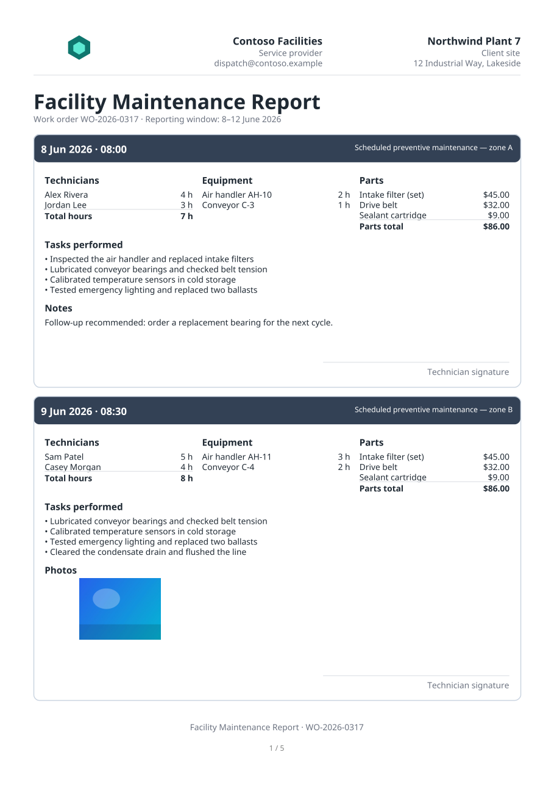</a> | **Annual report** — title + metric cards, 120-row ledger with a repeating header, zebra striping, periodic subtotals and a grand total; **5 pages**.<br>[code](composepdf/src/commonMain/kotlin/io/github/rikoappdev/composepdf/examples/ExampleDocuments.kt#L598) · [PDF](samples/annual-report.pdf)<br><a href="samples/annual-report.pdf">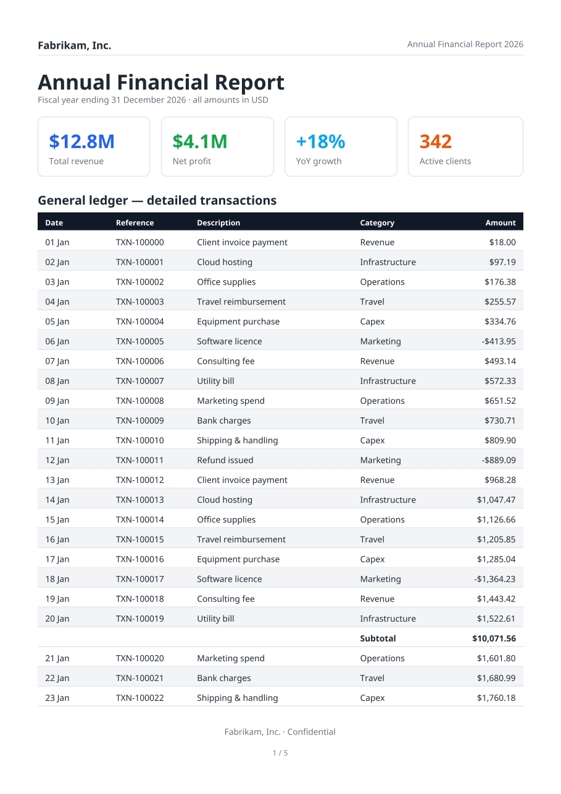</a> |
| **Product catalogue** — SVG brand mark in the header, categorized tables interleaved with photo grids; **3 pages**.<br>[code](composepdf/src/commonMain/kotlin/io/github/rikoappdev/composepdf/examples/ExampleDocuments.kt#L667) · [PDF](samples/product-catalog.pdf)<br><a href="samples/product-catalog.pdf">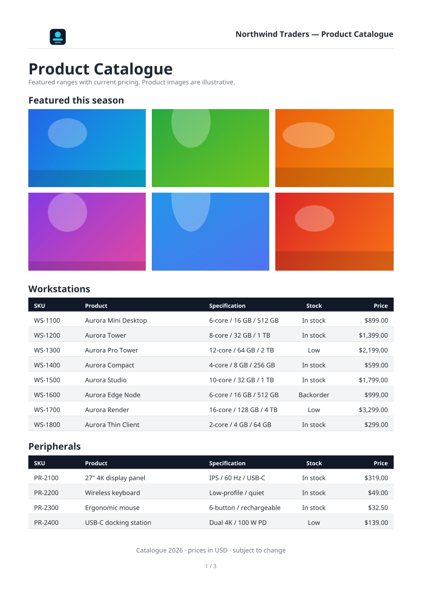</a> | **Service agreement** — 16 numbered sections of wrapped paragraphs (keep-together) + a signatures block; **6 pages**.<br>[code](composepdf/src/commonMain/kotlin/io/github/rikoappdev/composepdf/examples/ExampleDocuments.kt#L758) · [PDF](samples/service-agreement.pdf)<br><a href="samples/service-agreement.pdf"></a> |
| **Invoice** — weighted header columns, line-item table, stacked totals.<br>[code](composepdf/src/commonMain/kotlin/io/github/rikoappdev/composepdf/examples/ExampleDocuments.kt#L78) · [PDF](samples/invoice.pdf)<br><a href="samples/invoice.pdf">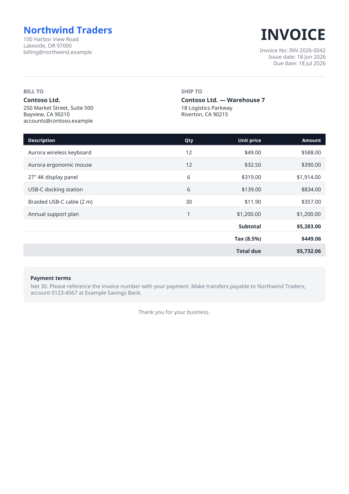</a> | **Business letter** — letterhead and automatically wrapped body paragraphs.<br>[code](composepdf/src/commonMain/kotlin/io/github/rikoappdev/composepdf/examples/ExampleDocuments.kt#L155) · [PDF](samples/business-letter.pdf)<br><a href="samples/business-letter.pdf">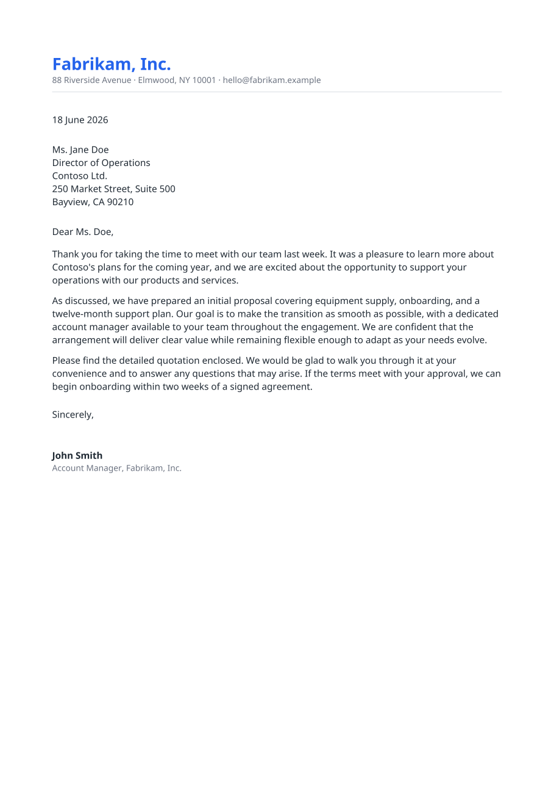</a> |
| **Price list** — repeating header band, multiple categorized tables.<br>[code](composepdf/src/commonMain/kotlin/io/github/rikoappdev/composepdf/examples/ExampleDocuments.kt#L205) · [PDF](samples/price-list.pdf)<br><a href="samples/price-list.pdf">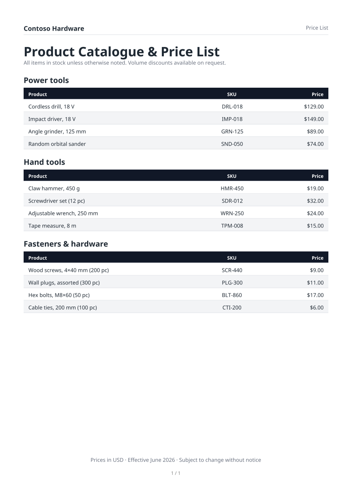</a> | **Status report** — summary box, metric cards, milestones table.<br>[code](composepdf/src/commonMain/kotlin/io/github/rikoappdev/composepdf/examples/ExampleDocuments.kt#L268) · [PDF](samples/status-report.pdf)<br><a href="samples/status-report.pdf">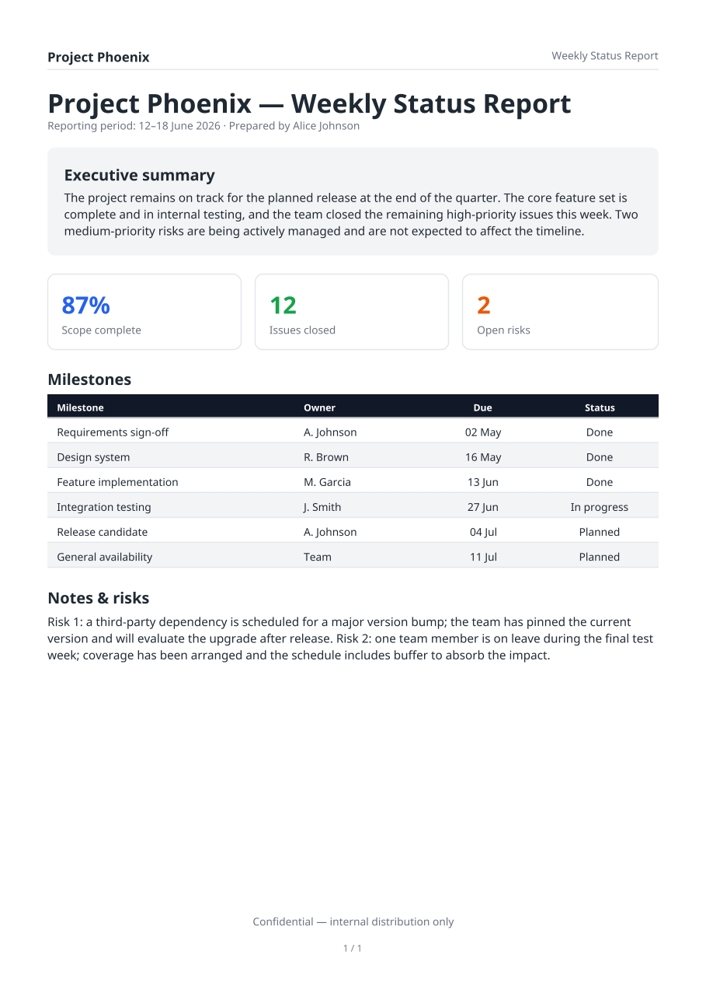</a> |
| **Transaction ledger** — 90 rows over **3 pages**, repeating table header + page numbers.<br>[code](composepdf/src/commonMain/kotlin/io/github/rikoappdev/composepdf/examples/ExampleDocuments.kt#L344) · [PDF](samples/transaction-ledger.pdf)<br><a href="samples/transaction-ledger.pdf">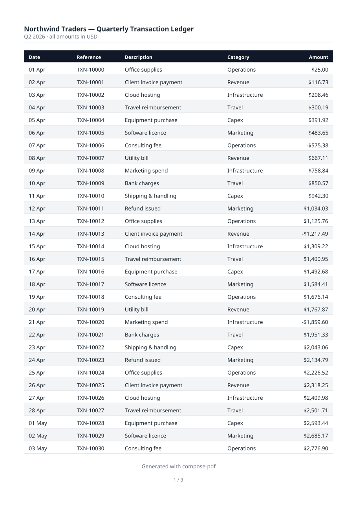</a> | **Photo gallery** — mixed aspect ratios laid out with `PhotoFit.Smart` / `Contain`.<br>[code](composepdf/src/commonMain/kotlin/io/github/rikoappdev/composepdf/examples/ExampleDocuments.kt#L391) · [PDF](samples/photo-gallery.pdf)<br><a href="samples/photo-gallery.pdf">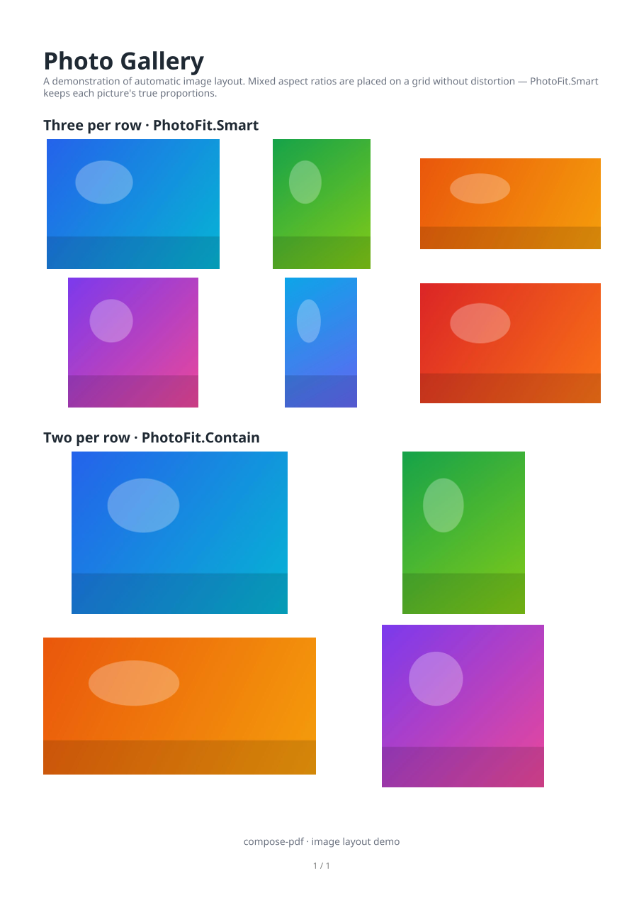</a> |
| **Résumé** — weighted two-column CV, section headings, a skills table; 1 page.<br>[code](composepdf/src/commonMain/kotlin/io/github/rikoappdev/composepdf/examples/ExampleDocuments.kt#L833) · [PDF](samples/resume.pdf)<br><a href="samples/resume.pdf">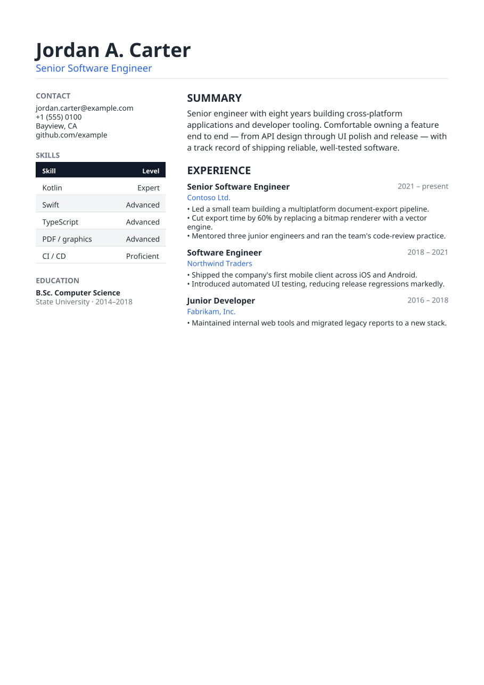</a> | **Event program** — header band + agenda schedule tables; 1 page.<br>[code](composepdf/src/commonMain/kotlin/io/github/rikoappdev/composepdf/examples/ExampleDocuments.kt#L919) · [PDF](samples/event-program.pdf)<br><a href="samples/event-program.pdf">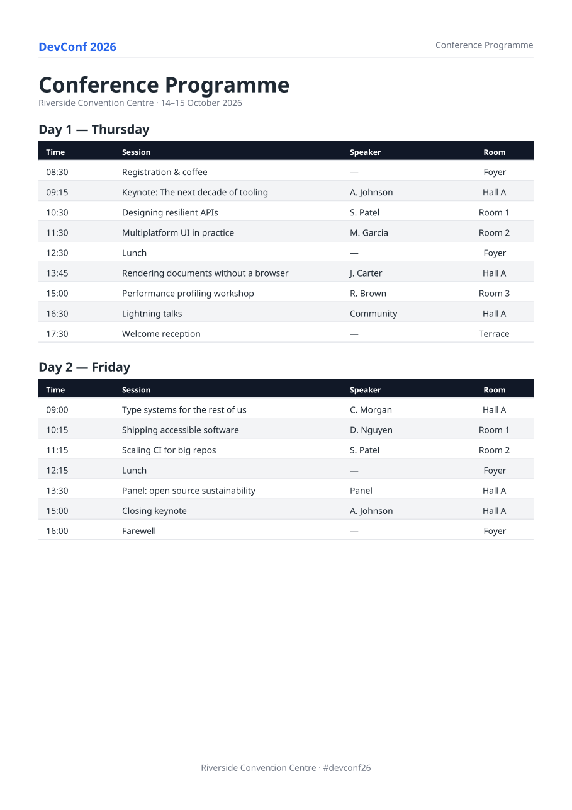</a> |

## Live preview (design-time `@Preview`)

The optional **`compose-pdf-preview`** artifact renders a `pdfDocument { … }` spec onto a Compose
`Canvas`, reusing the engine's **computed layout** — so you see your document **in the IDE preview
pane as you edit the builder**, with no app run and no export. It's a design-time tool (like a
`@Preview` of a screen), not an in-app "view instead of download" button.

```kotlin
// in androidMain — Android Studio renders androidMain @Preview live
@PdfDocumentPreview                            // pick …2Pages / …3Pages … 5Pages for longer reports
@Composable
fun MyReportPreview() = PdfPreview(
    myReport(data),                            // your pdfDocument { … } spec
    previewFontRegular(), previewFontBold(),   // a bundled font, loaded SYNCHRONOUSLY for @Preview
    pageWidth = PreviewPageWidthDp.dp,         // fixed page width → the preview self-sizes to the doc
)
```

- **Ready-made sizing annotations.** Android Studio's static `@Preview` needs `heightDp` as a
  compile-time constant, so a tall multi-page document otherwise gets clipped or padded with an empty
  strip. The artifact ships `@PdfDocumentPreview` (1 page) and `@PdfDocumentPreview2Pages` …
  `@PdfDocumentPreview5Pages` with the exact size baked in for a `PreviewPageWidthDp` (360 dp) page —
  put the one matching your report's page count on the `@Composable` and pass
  `pageWidth = PreviewPageWidthDp.dp`, and the pane shows every page in full (nothing clipped, no empty
  strip). A plain `@Preview` works too if you size it yourself.
- `previewFontRegular()` / `previewFontBold()` load a bundled Noto Sans **synchronously** — the async
  Compose-resources API does not work in the IDE preview runtime. (For the real export, pass your own
  `.ttf` to `render()`; the core stays font-agnostic and bundles no font.)
- Ready-to-open examples ship in the artifact (`ExamplePreviews.kt`): open it in the IDE and the pane
  renders the sample documents immediately.
- The preview runs the **same** layout pass as `render()`, so page count, line breaks, tables, boxes,
  images and vectors land where the PDF puts them. Each glyph is drawn at the engine's exact x, so
  columns and alignment match the PDF; only the glyph shapes come from the platform font (a faithful
  approximation — the PDF stays the source of truth).
- Targets **Android + JVM** (the platforms with an IDE preview runtime); the core engine remains
  Android + iOS + JVM. The UI-free `PdfDocumentSpec.previewPages(regular, bold)` in the core returns
  the resolved per-page draw model if you want to paint it on a different surface.

## Fonts

Fonts are supplied by **your application**, not bundled in the library. `render` takes the Regular
and Bold face bytes; the engine subsets and embeds only the glyphs a document uses. This keeps the
library font-agnostic and dependency-free, and gives identical output on every platform — the app
reads its own `.ttf` (via Compose Resources, Android assets, a file, the network, …) and passes the
bytes in.

A typical app keeps one **default** face and optionally lets the user pick another for export:

```kotlin
val regular: ByteArray = loadFont(selectedFont ?: defaultFont)        // your resource mechanism
val bold: ByteArray = loadFont((selectedFont ?: defaultFont).bold)
val pdf = document.render(regular, bold)
```

Any TrueType font works. For Latin diacritics (e.g. Czech/Slovak/Polish) pick a face that covers
Latin Extended-A/B, such as Noto Sans or DejaVu Sans.

### Color emoji

Pass an optional **color-emoji font** as a third argument and code points your text faces can't
render are drawn inline as real color bitmaps (the "phone" emoji look) instead of `.notdef` boxes:

```kotlin
val emoji: ByteArray = loadFont("NotoColorEmoji.ttf")   // an sbix or CBDT/CBLC color font
val pdf = document.render(regular, bold, emoji)
```

- Supported font formats: Apple **`sbix`** (Apple Color Emoji) and Google **`CBLC`/`CBDT`** (the
  classic large `NotoColorEmoji.ttf`) — each glyph carries a PNG, embedded as a normal image XObject.
- **Not** used: color **vector** fonts (`COLR`/`CPAL`, e.g. Segoe UI Emoji and Noto's newer COLRv1
  build) — they need an outline rasterizer; such code points fall back to the text `.notdef`.
- Single–code-point emoji are supported. ZWJ sequences (👨‍👩‍👧) and skin-tone modifiers render their
  base emoji (the joiner/modifier is dropped) since the engine does no GSUB shaping yet.
- Omitting the argument keeps output byte-for-byte identical to before — the feature is opt-in.
- The on-screen [`@Preview` bridge](#live-preview-design-time-preview) renders emoji code points as
  text (`.notdef`), not color bitmaps — the color emoji live in the exported PDF only.

## Building & testing

```
./gradlew :composepdf:jvmTest                          # identity + feature gates (incl. cross-platform golden)
./gradlew :composepdf:compileCommonMainKotlinMetadata  # shared-code purity check
./gradlew :composepdf:compileAndroidMain               # Android target
./gradlew :composepdf:iosSimulatorArm64Test            # runs the golden on iOS (macOS only)
```
Requires JDK 17+ (CI uses 21). The cross-platform golden test runs the layout engine over a fixed
document with deterministic metrics and asserts identical integer glyph origins on every platform.
Generated test PDFs/PNGs are written under `composepdf/build/`.

## Roadmap

- GPOS kerning / ligatures.
- More image formats (WebP, …).
- Complex scripts / RTL / bidi.
- Color **vector** emoji (`COLR`/`CPAL`) and ZWJ / skin-tone sequences.
- Long-word breaking inside narrow columns.
